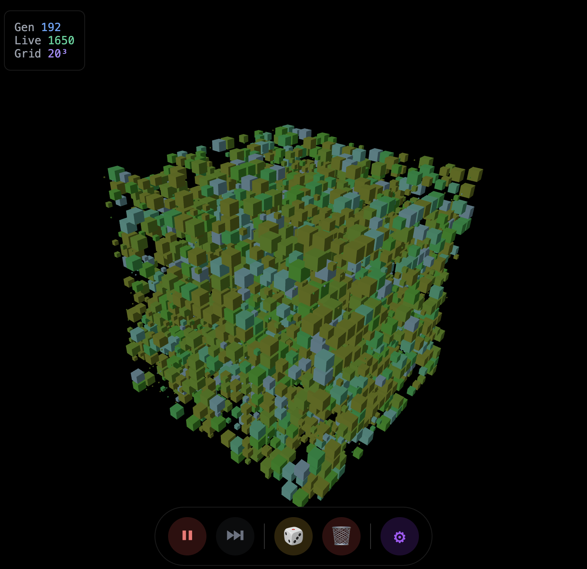

# 3D Game of Life

An interactive 3D implementation of Conway's Game of Life built with Next.js, Three.js, and React Three Fiber. Experience cellular automata in three dimensions with beautiful visualizations and real-time controls.



## 🌐 Live Demo

**[View Live Application](https://kenoir.github.io/3d-gol/)**

## ✨ Features

- **3D Visualization**: Watch cellular automata evolve in true 3D space
- **Interactive Controls**: 
  - Play/pause simulation
  - Step through generations manually
  - Randomize grid with custom density
  - Clear simulation
- **Customizable Parameters**:
  - Grid size (5×5×5 to 50×50×50)
  - Initial cell density
  - Simulation speed
- **Flexible Rules**:
  - Adjustable birth neighbor count
  - Configurable survival range
  - Periodic boundary conditions
- **Real-time Stats**: Track generation count, live cells, and grid size
- **3D Navigation**: Orbit controls for zooming, panning, and rotating
- **Responsive Design**: Works on desktop and mobile devices

## 🎮 Controls

### Main Interface
- **▶/⏸ Button**: Start/pause the simulation
- **⏭ Button**: Step forward one generation
- **🎲 Button**: Randomize the grid with current density setting
- **🗑 Button**: Clear all cells
- **⚙ Button**: Open settings panel

### Settings Panel
- **Grid Size**: Adjust the 3D grid dimensions
- **Initial Density**: Set the percentage of cells that start alive
- **Speed**: Control simulation update frequency
- **Birth Rule**: Number of neighbors required for a dead cell to become alive
- **Survival Range**: Min/max neighbors for a live cell to survive

### 3D Navigation
- **Mouse Drag**: Rotate the view
- **Scroll Wheel**: Zoom in/out
- **Right Click + Drag**: Pan the view

## 🚀 Technology Stack

- **Next.js 14**: React framework with static site generation
- **React 18**: Modern React with hooks and concurrent features
- **React Three Fiber**: React renderer for Three.js
- **Three.js**: 3D graphics library for WebGL rendering
- **@react-three/drei**: Essential helpers and components for React Three Fiber
- **TypeScript**: Type-safe development and enhanced developer experience

## 🛠 Development

### Prerequisites
- Node.js 18 or higher
- npm, yarn, or pnpm

### Installation

```bash
# Clone the repository
git clone https://github.com/kenoir/3d-gol.git
cd 3d-gol

# Install dependencies
npm install
# or
yarn install
# or
pnpm install
```

### Running Development Server

```bash
npm run dev
# or
yarn dev
# or
pnpm dev
```

Open [http://localhost:3000](http://localhost:3000) to view the application.

### Building for Production

```bash
npm run build
# or
yarn build
# or
pnpm build
```

## 📊 3D Game of Life Rules

This implementation extends Conway's classic 2D Game of Life to three dimensions with carefully balanced rules:

- **Neighborhood**: Each cell has 26 neighbors (3×3×3 cube minus the center)
- **Birth Rule**: A dead cell becomes alive if it has exactly N neighbors (configurable, default: 4)
- **Survival Rule**: A live cell survives if it has between Min and Max neighbors (configurable, default: 4-5)
- **Boundaries**: Periodic (toroidal) - cells on edges wrap around to the opposite side

### Why Different Rules?
The classic 2D Conway's rules (Birth: 3, Survival: 2-3) don't work in 3D because:
- **2D**: Each cell has 8 neighbors
- **3D**: Each cell has 26 neighbors (over 3× more!)

The default 3D rules (Birth: 4, Survival: 4-5) create more balanced dynamics:
- **Lower initial density** (8% vs typical 15% in 2D) prevents overcrowding
- **Tighter survival range** prevents explosive growth
- **Moderate birth rule** allows interesting pattern formation

### Interesting Rule Variants to Try:
- **Classic 3D Life**: Birth: 6-8, Survival: 5-7 (more conservative)
- **Explosive Growth**: Birth: 3-4, Survival: 5-8 (rapid expansion)
- **Crystal Growth**: Birth: 1, Survival: 1-2 (slow, crystalline patterns)
- **Sparse Ecology**: Birth: 2, Survival: 1-3 (sparse, fragile patterns)

### Visual Design
- **Age-based Coloring**: Cells change color based on how long they've been alive
- **Smooth Transitions**: Dead cells fade out gradually for better visual continuity
- **Instanced Rendering**: Optimized performance for large grids using Three.js instanced meshes

## 🚀 Deployment

### GitHub Pages (Automatic)

The project includes GitHub Actions workflow for automatic deployment:

1. Push your code to a GitHub repository
2. Go to repository Settings → Pages
3. Set source to "GitHub Actions"
4. The `.github/workflows/deploy.yml` handles deployment automatically

### Manual Deployment

```bash
# Build and export static files
npm run build

# Deploy the 'out' directory to your hosting service
```

## 🤝 Contributing

Contributions are welcome! Feel free to:
- Report bugs or suggest features via GitHub issues
- Submit pull requests for improvements
- Share interesting cellular automata patterns you discover

## 🎯 Future Enhancements

- **Pattern Library**: Save and load interesting 3D cellular automata patterns
- **Rule Presets**: Quick selection of well-studied 3D CA rule systems
- **Custom Rules**: More flexible rule definition system (e.g., range-based birth rules)  
- **Performance Optimization**: GPU compute shaders for larger grids
- **Pattern Analysis**: Tools to analyze pattern behavior, cycles, and stability
- **VR Support**: Virtual reality viewing for immersive 3D exploration

## 📝 License

This project is open source and available under the [MIT License](LICENSE).

---

Built with ❤️ (&🤖) using modern web technologies. Explore the fascinating world of 3D cellular automata! 